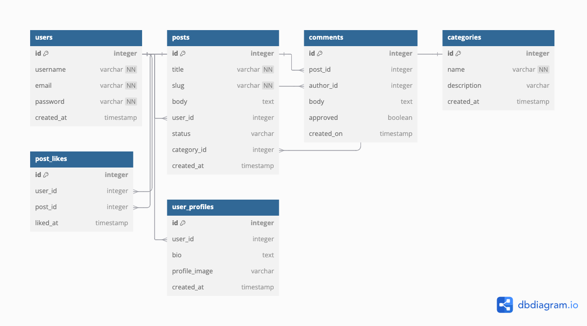
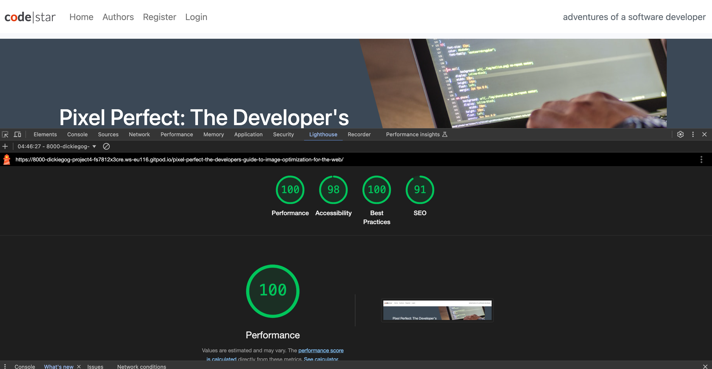
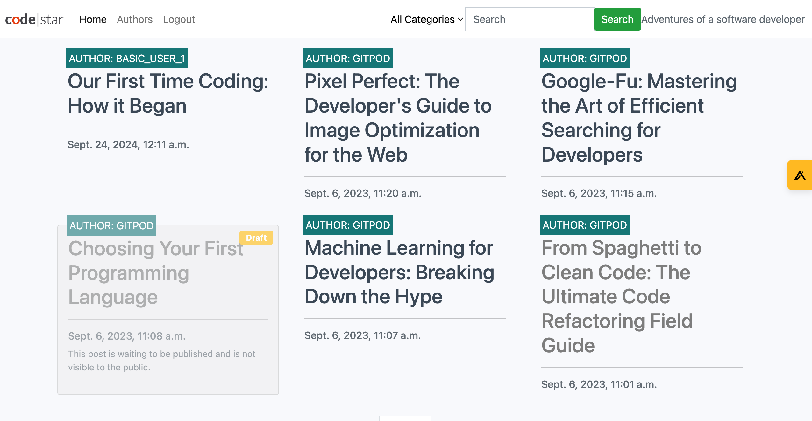

# Blog Application - Django Project

## Table of Contents

1. [Project Overview](#project-overview)
2. [User Experience (UX)](#user-experience-ux)
   - [User Stories](#user-stories)
3. [Features](#features)
   - [Implemented Features](#implemented-features)
   - [Future Features](#future-features)
4. [Database Design](#database-design)
5. [Technologies Used](#technologies-used)
6. [Testing](#testing)
   - [Manual Testing](#manual-testing)
   - [Automated Testing](#automated-testing)
7. [Deployment](#deployment)
8. [Credits](#credits)

## Project Overview

The **Blog Application** is a fully-featured blog platform built using Django. It allows users to view, comment on, and interact with blog posts. Authenticated users can submit comments, and site administrators can moderate and manage posts and comments via the Django admin panel. The project also includes an "About Me" page with a collaboration request form, where potential collaborators can reach out to the site owner.

## User Experience (UX)

### User Stories

- A list of user stories to explain functionality and how we developed them can be found here:
  (https://github.com/dickiegog/Project_4/issues)

## Features

### Implemented Features

- **Post Detail View**: Displays individual blog posts with the ability to leave, edit, or delete comments.
- **About Me Page**: Contains a form for potential collaborators to reach out to the site owner.
- **Comment System**: Users can leave comments on posts, edit or delete their own comments, and site admins can approve or delete comments.
- **Admin Management**: Site admins can manage posts and comments through the Django admin interface.

### Future Features

- **Comment Notifications**: Users could receive notifications when their comments are approved or replied to.
- **Post Categories**: Posts could be organized by categories or tags for better filtering.

## Database Design

The project uses Django's ORM for database management. The key models are:

- **Post**: Represents a blog post with fields such as `title`, `body`, `author`, `created_on`, `status`, and `slug`.
- **Comment**: Represents a comment left on a blog post with fields such as `post`, `author`, `body`, `approved`, and `created_on`.
- **About**: Represents the content for the "About Me" page.
- **CollaborateRequest**: Stores requests for collaboration, including `name`, `email`, and `message`.

### Diagram



## Technologies Used

- **Django 4.2.16**: The web framework used to build the application.
- **Python 3.12**: Programming language for backend logic.
- **PostgreSQL**: Database used in production.
- **Bootstrap 5**: Front-end framework for responsive design.
- **Crispy Forms**: Used for styling Django forms.
- **Summernote**: WYSIWYG editor for post creation.
- **Gunicorn**: WSGI HTTP server for serving the Django application.
- **Heroku**: Platform used for deploying the application.
- **GitHub**: Version control and project repository.

## Testing

### Manual Testing

- **Commenting System**:
  - Tested the ability for users to leave, edit, and delete comments.
  - Verified that site admins can approve or delete comments via the admin panel.
- **Form Validation**:
  - Submitted invalid data in forms to ensure validation messages are displayed.
  - Checked that the collaboration request form works as expected and is stored in the database.
- **Navigation**:
  - Tested that the navigation links (home, about, login, logout) function properly.
- **Mobile Responsiveness**:
  - Ensured that the application is responsive on different screen sizes using browser developer tools.

### Lighthouse Test

The Lighthouse test confirms that the web application meet has top marks for performance, accessibility, best practices, and SEO standards.



## Deployment

### Heroku Deployment

1. Ensure all dependencies are listed in `requirements.txt`:

   ```bash
   pip freeze > requirements.txt
   ```

2. Add `Procfile` to the root directory with the following content:

   ```bash
   web: gunicorn my_project.wsgi:application
   ```

3. Push the code to GitHub.

4. Create a new Heroku app:

   ```bash
   heroku create <app-name>
   ```

5. Set up PostgreSQL as the database:

   ```bash
   heroku addons:create heroku-postgresql:hobby-dev
   ```

6. Set environment variables:

   ```bash
   heroku config:set SECRET_KEY=<your-secret-key>
   heroku config:set DEBUG=False
   ```

7. Push to Heroku:

   ```bash
   git push heroku main
   ```

8. Run database migrations:

   ```bash
   heroku run python manage.py migrate
   ```

9. Collect static files:
   ```bash
   heroku run python manage.py collectstatic
   ```

### Local Deployment

To run the project locally:

1. Clone the repository:

   ```bash
   git clone https://github.com/dickiegog/Project_4.git
   ```

2. Install the dependencies:

   ```bash
   pip install -r requirements.txt
   ```

3. Set up the database and apply migrations:

   ```bash
   python manage.py makemigrations
   python manage.py migrate
   ```

4. Create a superuser:

   ```bash
   python manage.py createsuperuser
   ```

5. Run the development server:
   ```bash
   python manage.py runserver
   ```

### Home Page After Succesful Deployment



## Credits

- [FlyUX Project](https://github.com/CarlMurray/flyUX-pp4/blob/main/README.md) provided inspiration for structuring this README.
- The project uses several open-source libraries such as Django, Crispy Forms, and Bootstrap 5.

## Future Features

- Allow users to edit their profiles
- Allow users to like/ react to posts and commnets

## Requirements File

```txt
asgiref==3.8.1
crispy-bootstrap5==0.7
dj-database-url==0.5.0
Django==4.2.16
django-allauth==0.57.2
django-crispy-forms==2.3
django-summernote==0.8.20.0
gunicorn==20.1.0
oauthlib==3.2.2
psycopg2==2.9.9
PyJWT==2.9.0
python3-openid==3.2.0
requests-oauthlib==2.0.0
sqlparse==0.5.1
whitenoise==5.3.0
```
